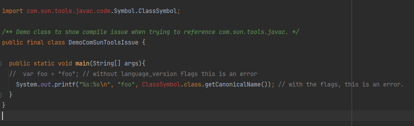

# Demo: `com.sun.tools` visibility vs. `var` keyword issue

Versions of things:
* OS: Windows 10
* Bazel: 7.1.1 (via Bazelisk 1.19.0)
* I also have my `JAVA_HOME` pointing at a local openjdk-15, but I don't think that's relevant 
  as bazel would be using remote jdks IIUC.


This project is a minimal example to demonstrate an issue I'm having trying to
create (and use) a repo in my registry for Google's `errorprone` library in order
to write custom `BugCheckers`.

After much experimentation, I have been able to reproduce this minimal example to demonstrate
the problem. The `errorprone` code uses both the `var` keyword and also references code under 
`com.sun.tools.javac`. I cannot get it to build without one or the other causing an error.

With `.bazelrc` as is, the command:
```
bazel build //java/com/bdl/demo/tools
```

Gives the error:
```
java\com\bdl\demo\tools\DemoComSunToolsIssue.java:9: warning: as of release 10, 'var' is a restricted type name and cannot be used for type declarations or as the element type of an array
    var foo = "foo";
        ^
java\com\bdl\demo\tools\DemoComSunToolsIssue.java:9: error: cannot find symbol
    var foo = "foo";
    ^
  symbol:   class var
  location: class DemoComSunToolsIssue

```

So it can't figure out the `var` keyword, which after realizing that the
[default language level](https://bazel.build/docs/user-manual#:~:text=The%20Java%20language%20version%20used,Default%20value%20is%208.), 
is 8 and not 11 like I thought, this makes sense.

So if I add flags to specify that the language level is 11:
```agsl
startup --output_user_root="D:/_bazel_out"
common  --enable_bzlmod=true --registry="file:///c:/projects/bazel/bzlmod/registry" --registry="https://bcr.bazel.build" --lockfile_mode=off
build --java_language_version=11 --tool_java_language_version=11
test --test_output=errors
```

Then the same command gives a different error:

```
ERROR: C:/projects/java/demos/com_sun_tools/java/com/bdl/demo/tools/BUILD:1:13: Building java/com/bdl/demo/tools/libtools.jar (1 source file) failed: (Exit 1): java.exe failed: error executing Javac command (from target //java/com/bdl/demo/tools:tools) external\rules_java~~toolchains~remotejdk21_win\bin\java.exe --add-exports=j
dk.compiler/com.sun.tools.javac.api=ALL-UNNAMED --add-exports=jdk.compiler/com.sun.tools.javac.main=ALL-UNNAMED ... (remaining 19 arguments skipped)
java\com\bdl\demo\tools\DemoComSunToolsIssue.java:3: error: package com.sun.tools.javac.code is not visible
import com.sun.tools.javac.code.Symbol.ClassSymbol;
                          ^
  (package com.sun.tools.javac.code is declared in module jdk.compiler, which does not export it to the unnamed module)
java\com\bdl\demo\tools\DemoComSunToolsIssue.java:10: error: cannot find symbol
    System.out.printf("%s:%s\n", foo, ClassSymbol.class.getCanonicalName());
                                      ^
  symbol:   class ClassSymbol
  location: class DemoComSunToolsIssue
Target //java/com/bdl/demo/tools:tools failed to build
```

Confusingly, note that the error says "package com.sun.tools.javac.code is declared in module jdk.compiler, which does not export it to the unnamed module"
but the command it gives as having run has the `--add-exports=jdk.compiler/com.sun.tools.javac.[various]=ALL-UNNAMED` 
flags, which I would expect to be the flags to cause that very export to occur and solve this error.

So, just in case, I also tried looking up the flags using `bazel query` and putting them 
directly in `bazelrc`, making it look like:

```
startup --output_user_root="D:/_bazel_out"
common  --enable_bzlmod=true --registry="file:///c:/projects/bazel/bzlmod/registry" --registry="https://bcr.bazel.build" --lockfile_mode=off
build \
  --java_language_version=11 \
  --tool_java_language_version=11 \
  --java_runtime_version=remotejdk_11 \
  --jvmopt="--add-exports=jdk.compiler/com.sun.tools.javac.api=ALL-UNNAMED" \
  --jvmopt="--add-exports=jdk.compiler/com.sun.tools.javac.main=ALL-UNNAMED" \
  --jvmopt="--add-exports=jdk.compiler/com.sun.tools.javac.model=ALL-UNNAMED" \
  --jvmopt="--add-exports=jdk.compiler/com.sun.tools.javac.processing=ALL-UNNAMED" \
  --jvmopt="--add-exports=jdk.compiler/com.sun.tools.javac.resources=ALL-UNNAMED" \
  --jvmopt="--add-exports=jdk.compiler/com.sun.tools.javac.tree=ALL-UNNAMED" \
  --jvmopt="--add-exports=jdk.compiler/com.sun.tools.javac.util=ALL-UNNAMED" \
  --jvmopt="--add-opens=jdk.compiler/com.sun.tools.javac.code=ALL-UNNAMED" \
  --jvmopt="--add-opens=jdk.compiler/com.sun.tools.javac.comp=ALL-UNNAMED" \
  --jvmopt="--add-opens=jdk.compiler/com.sun.tools.javac.file=ALL-UNNAMED" \
  --jvmopt="--add-opens=jdk.compiler/com.sun.tools.javac.parser=ALL-UNNAMED"
test --test_output=errors
```
But this did not help.

I also commented out the `var` keyword stuff and tried setting the language version levels to 9, 
and the `com.sun.tools.javac` error was present for that version as well.

Finally, while this is likely related to the IJ plugin and how it fetches, if I change the code to:
```java

/** Demo class to show compile issue when trying to reference com.sun.tools.javac. */
public final class DemoComSunToolsIssue {

  public static void main(String[] args){
    // var foo = "foo"; // without language_version flags this is an error
    System.out.printf("%s:%s\n", "foo", ClassSymbol.class.getCanonicalName()); // with the flags, this is an error.
  }
}
```
to remove the `var` keyword, so it can compile without the language flags, a project sync succeeds,
but the import remains red and no autocomplete is available.


I don't know much about customizing the toolchain. Ideally if I need to do so, it would be good 
to be able to do that in a single place so my system `bazelrc` file can specify it and I don't need 
to repeat the configuration in every workspace. 

## Updates
Filed a [issues/21983](https://github.com/bazelbuild/bazel/issues/21983) on he bazel github 
target since stackoverflow got no hits and this seems like a bug.

Got a [reply](https://github.com/bazelbuild/bazel/issues/21983#issuecomment-2051220568), so to
have all the answers in one place:

I tried modifying the project's `.bazelrc` to:

```
startup --output_user_root="D:/_bazel_out"
common  --enable_bzlmod=true --registry="file:///c:/projects/bazel/bzlmod/registry" --registry="https://bcr.bazel.build" --lockfile_mode=off
build \
  --java_language_version=11 \
  --tool_java_language_version=11 \
  --javacopt="--add-exports=jdk.compiler/com.sun.tools.javac.api=ALL-UNNAMED" \
  --javacopt="--add-exports=jdk.compiler/com.sun.tools.javac.main=ALL-UNNAMED" \
  --javacopt="--add-exports=jdk.compiler/com.sun.tools.javac.model=ALL-UNNAMED" \
  --javacopt="--add-exports=jdk.compiler/com.sun.tools.javac.processing=ALL-UNNAMED" \
  --javacopt="--add-exports=jdk.compiler/com.sun.tools.javac.resources=ALL-UNNAMED" \
  --javacopt="--add-exports=jdk.compiler/com.sun.tools.javac.tree=ALL-UNNAMED" \
  --javacopt="--add-exports=jdk.compiler/com.sun.tools.javac.util=ALL-UNNAMED" \
  --javacopt="--add-opens=jdk.compiler/com.sun.tools.javac.code=ALL-UNNAMED" \
  --javacopt="--add-opens=jdk.compiler/com.sun.tools.javac.comp=ALL-UNNAMED" \
  --javacopt="--add-opens=jdk.compiler/com.sun.tools.javac.file=ALL-UNNAMED" \
  --javacopt="--add-opens=jdk.compiler/com.sun.tools.javac.parser=ALL-UNNAMED"
test --test_output=errors
```

but the same error:
```
warning: [options] --add-opens has no effect at compile time
java\com\bdl\demo\tools\DemoComSunToolsIssue.java:3: error: package com.sun.tools.javac.code is not visible
import com.sun.tools.javac.code.Symbol.ClassSymbol;
                          ^
  (package com.sun.tools.javac.code is declared in module jdk.compiler, which does not export it to the unnamed module)
java\com\bdl\demo\tools\DemoComSunToolsIssue.java:10: error: cannot find symbol
    System.out.printf("%s:%s\n", foo, ClassSymbol.class.getCanonicalName()); // with the flags, this is an error.
                                      ^
  symbol:   class ClassSymbol
  location: class DemoComSunToolsIssue
Target //java/com/bdl/demo/tools:tools failed to build
```

Well, almost the same: the `warning: [options] --add-opens has no effect at compile time` is new.

So, then I tried instead adding them to the build target:
```
java_library(
    name = "tools",
    srcs = glob(["*.java"]),
    javacopts = [
        "--add-exports=jdk.compiler/com.sun.tools.javac.api=ALL-UNNAMED",
        "--add-exports=jdk.compiler/com.sun.tools.javac.main=ALL-UNNAMED",
        "--add-exports=jdk.compiler/com.sun.tools.javac.model=ALL-UNNAMED",
        "--add-exports=jdk.compiler/com.sun.tools.javac.processing=ALL-UNNAMED",
        "--add-exports=jdk.compiler/com.sun.tools.javac.resources=ALL-UNNAMED",
        "--add-exports=jdk.compiler/com.sun.tools.javac.tree=ALL-UNNAMED",
        "--add-exports=jdk.compiler/com.sun.tools.javac.util=ALL-UNNAMED",
        "--add-opens=jdk.compiler/com.sun.tools.javac.code=ALL-UNNAMED",
        "--add-opens=jdk.compiler/com.sun.tools.javac.comp=ALL-UNNAMED",
        "--add-opens=jdk.compiler/com.sun.tools.javac.file=ALL-UNNAMED",
        "--add-opens=jdk.compiler/com.sun.tools.javac.parser=ALL-UNNAMED",
    ],
    visibility = ["//visibility:public"],
    deps = [],
)
```

Interestingly, when I added that but took out the changes to `bazlerc` (including the java language level flags, I got the `var` error again.
```
java\com\bdl\demo\tools\DemoComSunToolsIssue.java:9: warning: as of release 10, 'var' is a restricted type name and cannot be used for type declarations or as the element type of an array
    var foo = "foo"; // without language_version flags this is an error
        ^
java\com\bdl\demo\tools\DemoComSunToolsIssue.java:9: error: cannot find symbol
    var foo = "foo"; // without language_version flags this is an error
    ^
  symbol:   class var
  location: class DemoComSunToolsIssue
Target //java/com/bdl/demo/tools:tools failed to build
```

Adding the language level flags back in (so language level at `bazelrc` and `javacopts` in the `BUILD` target) gave:
```
warning: [options] --add-opens has no effect at compile time
java\com\bdl\demo\tools\DemoComSunToolsIssue.java:3: error: package com.sun.tools.javac.code is not visible
import com.sun.tools.javac.code.Symbol.ClassSymbol;
                          ^
  (package com.sun.tools.javac.code is declared in module jdk.compiler, which does not export it to the unnamed module)
java\com\bdl\demo\tools\DemoComSunToolsIssue.java:10: error: cannot find symbol
    System.out.printf("%s:%s\n", foo, ClassSymbol.class.getCanonicalName()); // with the flags, this is an error.
                                      ^
  symbol:   class ClassSymbol
  location: class DemoComSunToolsIssue
Target //java/com/bdl/demo/tools:tools failed to build
```

So the same error as above, including the warning about --add-opens having no effect at compile time.
